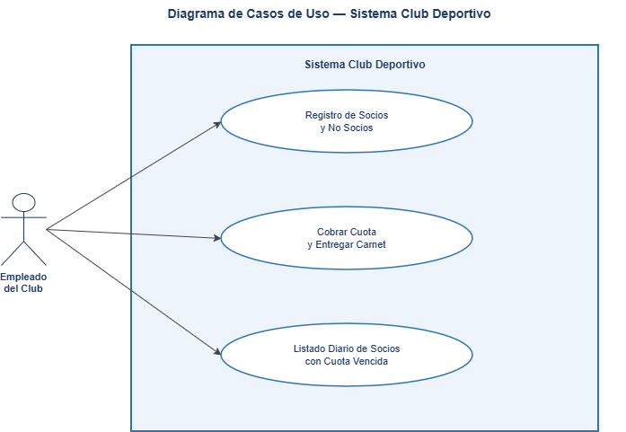
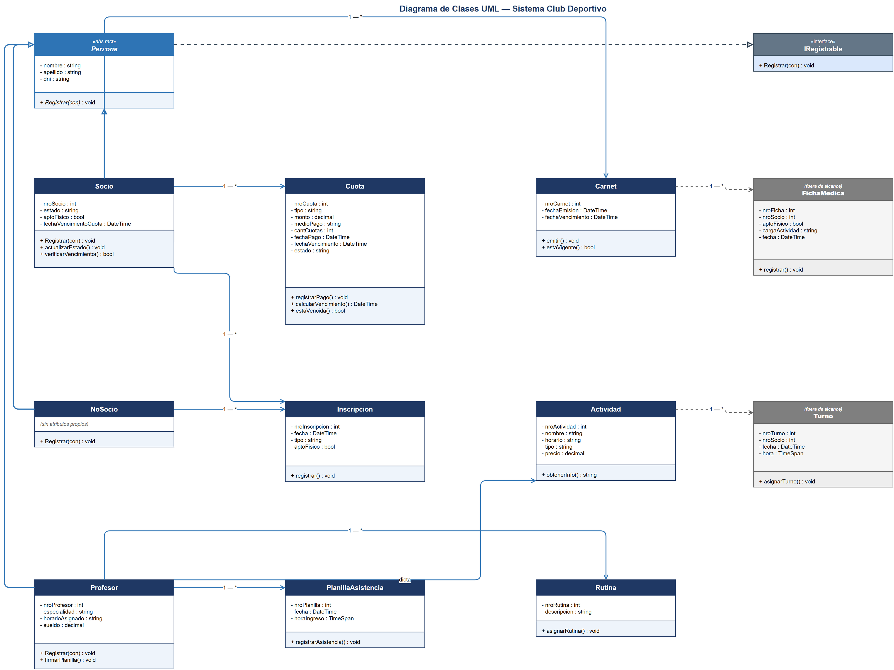

# Club Deportivo — Sistema de Gestión

Aplicación de escritorio en **C# (WinForms)** con persistencia en **MySQL**, desarrollada como trabajo práctico integrador para la materia *Desarrollo de Sistemas Orientado a Objetos*. Resuelve la gestión operativa diaria de un club deportivo: alta de socios, cobro de cuotas y emisión de carnets, y control de vencimientos.

## Funcionalidades

- **Login de empleados** contra base de datos (`sp_ValidarLogin`).
- **Registro de socios y no socios**, con validación de DNI duplicado y requisito de apto físico para socios.
- **Cobro de cuota mensual** (socios) y **cobro por actividad** (no socios), con soporte de pago en efectivo o tarjeta (1, 3, 6 o 12 cuotas) y emisión automática de carnet al cobrar.
- **Listado diario de socios con cuota vencida**, actualizando automáticamente el estado de los socios antes de mostrarlo.
- **Vista del plantel de profesores** (solo lectura).

## Stack técnico

| Componente | Tecnología |
|---|---|
| UI | C# · WinForms (.NET) |
| Base de datos | MySQL 8 |
| Acceso a datos | ADO.NET (`MySql.Data` driver oficial) |
| Lógica de negocio | Stored Procedures en MySQL |

## Arquitectura

El sistema está organizado en tres capas:

```
Formularios (WinForms)
        ↓
Clases de modelo (Persona, Socio, NoSocio, Cuota, Carnet...)
        ↓
Conexion (Singleton) → MySQL (tablas + stored procedures)
```

### Modelo de objetos

- `Persona` es una clase **abstracta** que implementa la interfaz `IRegistrable` y define los atributos comunes (nombre, apellido, DNI).
- `Socio`, `NoSocio` y `Profesor` heredan de `Persona`. Cada una implementa `Registrar()` de forma distinta (**polimorfismo**): `Socio` y `NoSocio` insertan en su tabla correspondiente vía stored procedure; `Profesor` queda fuera del alcance funcional actual.
- `Cuota` y `Carnet` modelan los datos de pago y acreditación, con lógica propia de vencimiento (`EstaVencida()`, `EstaVigente()`).

### Acceso a datos

La clase `Conexion` implementa el patrón **Singleton**: una única instancia gestiona la conexión a MySQL durante toda la ejecución, reabriendo la conexión si se cierra inesperadamente. La mayoría de las operaciones de escritura usan **stored procedures** con parámetros tipados (incluyendo parámetros `OUT` para validaciones como DNI duplicado o login), manteniendo la lógica de negocio crítica en la base de datos antes que en el cliente.

## Diagramas

**Diagrama de casos de uso** — el empleado del club interactúa con los tres procesos centrales del sistema:



**Diagrama de clases UML** — incluye el modelo implementado y una proyección a futuro (ficha médica, turnos, rutinas) pensada para una segunda iteración del sistema:



## Cómo correrlo

### Requisitos
- Visual Studio 2022+ (o `dotnet` CLI) con soporte para .NET y Windows Forms
- MySQL Server 8.x

### Pasos

1. Crear la base de datos ejecutando el script `ClubDeportivo.sql` (en la raíz de este repositorio) — crea la base, las tablas, los stored procedures y carga datos de ejemplo.
2. Ajustar la cadena de conexión en `Conexion.cs` si el usuario/contraseña de MySQL no coincide con el entorno local:
   ```csharp
   private const string ConnectionString =
       "Server=localhost;Database=ClubDeportivo;Uid=root;Pwd=rootpass;CharSet=utf8mb4;";
   ```
3. Restaurar el paquete NuGet `MySql.Data` y compilar (`dotnet build` o desde Visual Studio).
4. Ejecutar. Usuario de prueba: `admin` / `admin123`.

## Posibles mejoras

- Externalizar la cadena de conexión a un archivo de configuración en lugar de tenerla hardcodeada.
- Migrar de ADO.NET puro a un ORM (Entity Framework Core o Dapper) para reducir SQL manual.
- Aplicar el patrón Repository para desacoplar el acceso a datos de los formularios.
- Completar el módulo de profesores (actualmente sin flujo de alta).

## Equipo

Trabajo práctico grupal — Desarrollo de Sistemas Orientado a Objetos.

---
*Este repositorio contiene el código fuente, el script de base de datos y los diagramas UML del proyecto. No incluye el ejecutable compilado.*
